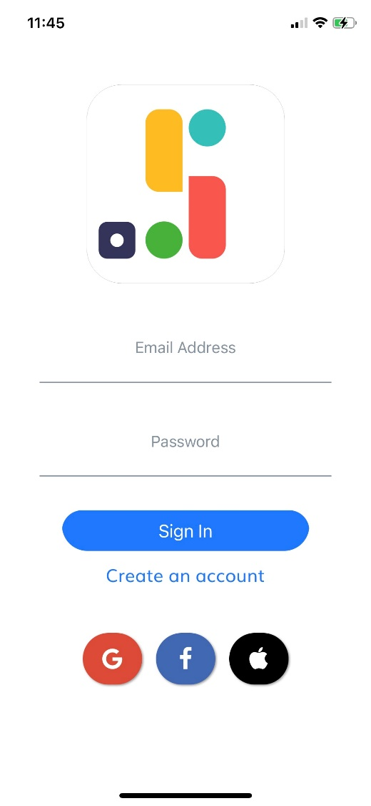

    

# FOA 

    During 15 weeks, I did my traineeship within SB-IT. This experience made me discover the professional side of the development world. I have been able to develop many skills such as teamwork, hierarchy between different people in a company, making the right decisions, etc ... and this has allowed me to learn a lot. The aim of my internship was initially the realization of a cross-Platform mobile application allowing the management of shared shopping lists and then in a second time, the objective was widened and became a cross-Platform application who manages the organization of a family.

 

    Durant 15 semaines, j’ai effectué mon stage au sein de l’entreprise SB-IT. Cette expérience m’a fait découvrir la partie professionnelle du monde du développement. J’ai pu développer de nombreuses compétences comme le travail en équipe, la hiérarchie entre les différentes personnes d’une entreprise, prendre les bonnes décisions, etc... et cela m’a permis d’apprendre de nouvelles choses. Ce stage avait comme objectif dans un premier temps, la réalisation d’une application mobile cross-plateforme permettant la gestion de listes de courses partagées et ensuite dans un second temps, l’objectif s’est élargie et est devenu une application cross-plateforme qui gère l’organisation d’une famille.

# Screens

## On boarding 

## Authentication

## Groceries

## To Do's

## Recipes

## Cooking Mode

## Events

## Settings
